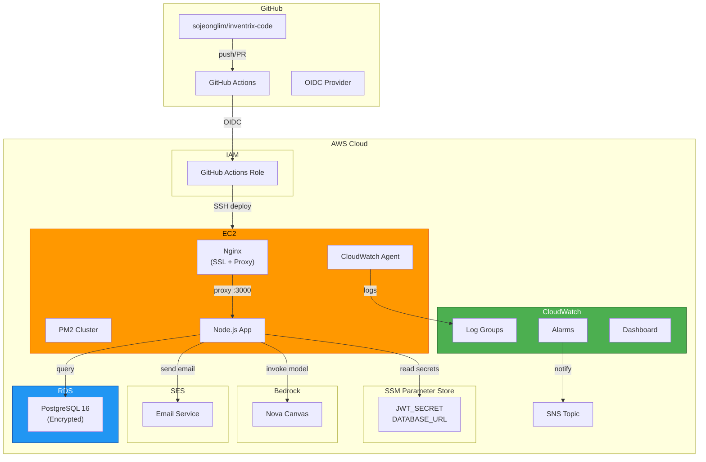

# Deployment Architecture — Infrastructure Unit

---

## 배포 아키텍처 다이어그램



### Text Alternative

```
GitHub Repository
  → GitHub Actions (CI/CD)
  → OIDC → IAM Role
  → SSH Deploy to EC2

EC2 Instance:
  Nginx (port 80/443) → Node.js App (port 3000, PM2 cluster)
  CloudWatch Agent → CloudWatch Logs

Node.js App:
  → RDS PostgreSQL (port 5432, encrypted)
  → SSM Parameter Store (secrets)
  → SES (email)
  → Bedrock (AI image)

CloudWatch Alarms → SNS → Email
```

---

## 배포 흐름

### CI 파이프라인 (PR)

```
1. Developer pushes to feature branch
2. Opens PR to main
3. GitHub Actions CI triggers:
   a. Checkout code
   b. Setup Node.js 22 + pnpm
   c. pnpm install --frozen-lockfile
   d. pnpm lint (ESLint)
   e. pnpm type-check (tsc --noEmit)
   f. pnpm test (Vitest)
   g. pnpm build (frontend + backend)
   h. npm audit --audit-level=high
4. PR status check: pass/fail
```

### CD Staging 파이프라인 (merge to main)

```
1. PR merged to main
2. CI passes (위 단계)
3. CD Staging triggers:
   a. Configure AWS credentials (OIDC)
   b. SSH to staging EC2
   c. cd /var/www/inventrix
   d. git pull origin main
   e. pnpm install --frozen-lockfile
   f. pnpm build
   g. pm2 reload ecosystem.config.js --env staging
   h. Health check: curl -f https://staging.inventrix.example.com/api/health
   i. 실패 시: pm2 reload --previous + Slack/Email 알림
```

### CD Production 파이프라인 (manual/tag)

```
1. Manual dispatch 또는 release tag 생성
2. CI passes
3. Required reviewer 승인
4. CD Production triggers:
   a. Configure AWS credentials (OIDC)
   b. SSH to production EC2
   c. cd /var/www/inventrix
   d. git pull origin main (또는 tag checkout)
   e. pnpm install --frozen-lockfile
   f. pnpm build
   g. pm2 reload ecosystem.config.js --env production
   h. Health check: curl -f https://inventrix.example.com/api/health
   i. 실패 시: pm2 reload --previous + 즉시 알림
```

---

## Health Check 엔드포인트

```typescript
// GET /api/health
// 응답: { status: 'ok', timestamp: string, version: string }
// DB 연결 확인 포함
```

---

## 초기 프로비저닝 순서

```
1. CDK bootstrap (첫 배포 시 1회)
   cdk bootstrap aws://ACCOUNT/REGION

2. Secrets 설정 (수동 또는 CDK context)
   aws ssm put-parameter --name /inventrix/production/JWT_SECRET --type SecureString --value "..."
   aws ssm put-parameter --name /inventrix/production/DATABASE_URL --type SecureString --value "..."

3. CDK deploy (순서 중요)
   cdk deploy InventrixNetworkStack
   cdk deploy InventrixDatabaseStack
   cdk deploy InventrixSecretsStack
   cdk deploy InventrixComputeStack
   cdk deploy InventrixMonitoringStack
   cdk deploy InventrixSESStack

4. DNS 설정 (수동)
   - 도메인 → Elastic IP
   - SES DKIM/SPF 레코드

5. SSL 설정
   - certbot --nginx -d inventrix.example.com

6. 초기 배포
   - git clone → pnpm install → pnpm build → pm2 start

7. DB 마이그레이션
   - pnpm migrate (Prisma 또는 직접 SQL)
   - 시드 데이터 삽입
```

---

## 비용 요약

| 서비스 | Staging (월) | Production (월) |
|---|---|---|
| EC2 t3.small/medium | ~$15 | ~$30 |
| RDS db.t3.micro/small | ~$13 | ~$26 |
| EBS (20GB gp3) | ~$2 | ~$2 |
| CloudWatch Logs | ~$1 | ~$3 |
| SSM Parameter Store | 무료 (Standard) | 무료 (Standard) |
| SES | ~$0 (소량) | ~$1 |
| Elastic IP | 무료 (연결 시) | 무료 (연결 시) |
| **합계** | **~$31** | **~$62** |
