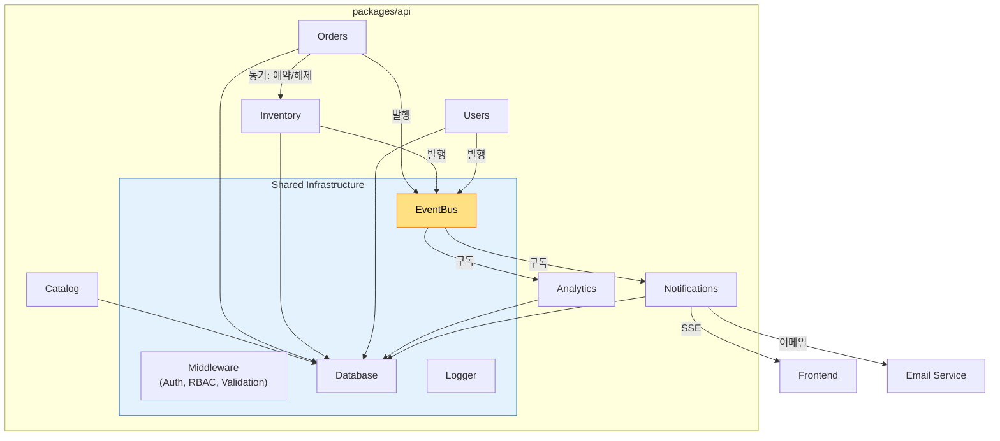

# Component Dependencies

## 모듈 의존성 매트릭스

| 소스 모듈 | 대상 모듈 | 통신 방식 | 관계 |
|---|---|---|---|
| Orders | Inventory (ReservationService) | 동기 호출 | 주문 생성/취소 시 재고 예약/해제 |
| Orders | EventBus | 이벤트 발행 | OrderCreated, OrderStatusChanged, OrderCancelled |
| Inventory | EventBus | 이벤트 발행 | StockLow, StockDepleted, ReservationExpired |
| Users | EventBus | 이벤트 발행 | RoleChanged, LoginFailed |
| Notifications | EventBus | 이벤트 구독 | 모든 도메인 이벤트 수신 → 알림 생성 |
| Analytics | EventBus | 이벤트 구독 | 주문/재고 이벤트 수신 → KPI 업데이트 |
| Catalog | — | 독립 | 다른 모듈에 의존하지 않음 |

## 의존성 다이어그램

## 통신 패턴 상세

### 동기 의존성 (직접 호출)
- **Orders → Inventory**: OrderService가 ReservationService를 DI로 주입받아 직접 호출
  - `createReservation()` — 주문 생성 시
  - `releaseReservation()` — 주문 취소 시
  - `confirmReservation()` — 주문 확정 시
  - 실패 시 전체 트랜잭션 롤백

### 비동기 의존성 (EventBus)
- **Orders → Notifications**: OrderCreated, OrderStatusChanged, OrderCancelled
- **Orders → Analytics**: OrderCreated, OrderStatusChanged
- **Inventory → Notifications**: StockLow, StockDepleted
- **Inventory → Analytics**: StockLow
- **Users → Notifications**: RoleChanged, LoginFailed (보안 이벤트)

## 도메인 이벤트 목록

| 이벤트 | 발행 모듈 | 구독 모듈 | 트리거 |
|---|---|---|---|
| OrderCreated | Orders | Notifications, Analytics | 주문 생성 완료 |
| OrderStatusChanged | Orders | Notifications, Analytics | 상태 전이 |
| OrderCancelled | Orders | Notifications, Analytics | 주문 취소 |
| StockLow | Inventory | Notifications, Analytics | 재고 임계값 이하 |
| StockDepleted | Inventory | Notifications | 재고 0 |
| ReservationExpired | Inventory | Notifications | 예약 타임아웃 |
| RoleChanged | Users | Notifications | 역할 변경 |
| LoginFailed | Users | Notifications | 연속 로그인 실패 (보안) |

## 모듈 독립성 규칙

1. 각 모듈은 자체 Repository를 통해서만 DB에 접근 (다른 모듈의 테이블 직접 접근 금지)
2. 동기 의존성은 Service 인터페이스를 통해서만 허용 (구현체 직접 참조 금지)
3. 비동기 통신은 반드시 EventBus를 통해 수행
4. 순환 의존성 금지
