# Execution Plan

## Detailed Analysis Summary

### Transformation Scope
- **Transformation Type**: Architectural (모놀리식 → 모듈러 모놀리스 + DB 마이그레이션 + RBAC + 실시간 기능)
- **Primary Changes**: 아키텍처 리팩토링, DB 교체, 보안 강화, 신규 기능 추가
- **Related Components**: packages/api (전면 리팩토링), packages/frontend (UI 현대화), 신규 인프라 구성

### Change Impact Assessment
- **User-facing changes**: Yes — 반응형 디자인, 다크 모드, 실시간 알림, RBAC UI
- **Structural changes**: Yes — Fat Routes → 모듈러 모놀리스 (Service/Repository 계층)
- **Data model changes**: Yes — RBAC 역할, 재고 예약, 환불 상태, 알림 테이블 추가
- **API changes**: Yes — 역할 기반 접근 제어, 신규 엔드포인트 (알림, 역할 관리, SSE)
- **NFR impact**: Yes — 보안 전면 강화, 성능 최적화, 확장성 설계

### Component Relationships

```
+--------------------------------------------------+
| Inventrix Monorepo (pnpm)                        |
|                                                  |
|  +--------------------+  +--------------------+  |
|  | packages/api       |  | packages/frontend  |  |
|  | (Express + TS)     |  | (Vite + React + TS)|  |
|  |                    |  |                    |  |
|  | modules/           |  | components/        |  |
|  |  orders/           |  | pages/             |  |
|  |  inventory/        |  | contexts/          |  |
|  |  catalog/          |  | hooks/             |  |
|  |  users/            |  | styles/            |  |
|  |  analytics/        |  |                    |  |
|  |  notifications/    |  |                    |  |
|  +--------+-----------+  +--------+-----------+  |
|           |     REST API          |              |
|           +<----------------------+              |
|           |                                      |
|  +--------v-----------+                          |
|  | Database           |                          |
|  | (Production DB)    |                          |
|  +--------------------+                          |
|                                                  |
|  +--------------------+                          |
|  | External Services  |                          |
|  | - AWS Bedrock      |                          |
|  | - Email Service    |                          |
|  +--------------------+                          |
+--------------------------------------------------+
```

- **Primary Component**: packages/api (전면 리팩토링)
  - Change Type: Major
  - Change Reason: 아키텍처 전환, DB 교체, RBAC, 실시간 기능
- **Secondary Component**: packages/frontend (UI 현대화)
  - Change Type: Major
  - Change Reason: 반응형, 다크 모드, RBAC UI, 알림 UI, 스타일링 체계화
- **Infrastructure**: 신규 구성 필요
  - Change Type: Major
  - Change Reason: DB 인프라, 이메일 서비스, 배포 모델

### Risk Assessment
- **Risk Level**: High
- **Rollback Complexity**: Difficult (아키텍처 전환, DB 마이그레이션)
- **Testing Complexity**: Complex (모듈 간 통합, 동시성, RBAC, 실시간)

---

## Workflow Visualization

```mermaid
flowchart TD
    Start(["사용자 요청"])

    subgraph INCEPTION["INCEPTION PHASE"]
        WD["Workspace Detection<br/><b>COMPLETED</b>"]
        RS["Research<br/><b>COMPLETED</b>"]
        RE["Reverse Engineering<br/><b>COMPLETED</b>"]
        RA["Requirements Analysis<br/><b>COMPLETED</b>"]
        US["User Stories<br/><b>COMPLETED</b>"]
        WP["Workflow Planning<br/><b>IN PROGRESS</b>"]
        AD["Application Design<br/><b>EXECUTE</b>"]
        UG["Units Generation<br/><b>EXECUTE</b>"]
    end

    subgraph CONSTRUCTION["CONSTRUCTION PHASE"]
        direction TB
        LOOP["Per-Unit Loop"]
        FD["Functional Design<br/><b>EXECUTE</b>"]
        NFR_R["NFR Requirements<br/><b>EXECUTE</b>"]
        NFR_D["NFR Design<br/><b>EXECUTE</b>"]
        ID["Infrastructure Design<br/><b>EXECUTE</b>"]
        CG["Code Generation<br/><b>EXECUTE</b>"]
        BT["Build and Test<br/><b>EXECUTE</b>"]
    end

    subgraph OPERATIONS["OPERATIONS PHASE"]
        OPS["Operations<br/><b>PLACEHOLDER</b>"]
    end

    Start --> WD
    WD --> RS
    RS --> RE
    RE --> RA
    RA --> US
    US --> WP
    WP --> AD
    AD --> UG
    UG --> LOOP
    LOOP --> FD
    FD --> NFR_R
    NFR_R --> NFR_D
    NFR_D --> ID
    ID --> CG
    CG -->|다음 Unit| LOOP
    CG -->|모든 Unit 완료| BT
    BT --> OPS
    OPS --> End(["Complete"])

    style WD fill:#4CAF50,stroke:#1B5E20,stroke-width:3px,color:#fff
    style RS fill:#4CAF50,stroke:#1B5E20,stroke-width:3px,color:#fff
    style RE fill:#4CAF50,stroke:#1B5E20,stroke-width:3px,color:#fff
    style RA fill:#4CAF50,stroke:#1B5E20,stroke-width:3px,color:#fff
    style US fill:#4CAF50,stroke:#1B5E20,stroke-width:3px,color:#fff
    style WP fill:#FFA726,stroke:#E65100,stroke-width:3px,stroke-dasharray: 5 5,color:#000
    style AD fill:#FFA726,stroke:#E65100,stroke-width:3px,stroke-dasharray: 5 5,color:#000
    style UG fill:#FFA726,stroke:#E65100,stroke-width:3px,stroke-dasharray: 5 5,color:#000
    style FD fill:#FFA726,stroke:#E65100,stroke-width:3px,stroke-dasharray: 5 5,color:#000
    style NFR_R fill:#FFA726,stroke:#E65100,stroke-width:3px,stroke-dasharray: 5 5,color:#000
    style NFR_D fill:#FFA726,stroke:#E65100,stroke-width:3px,stroke-dasharray: 5 5,color:#000
    style ID fill:#FFA726,stroke:#E65100,stroke-width:3px,stroke-dasharray: 5 5,color:#000
    style CG fill:#4CAF50,stroke:#1B5E20,stroke-width:3px,color:#fff
    style BT fill:#4CAF50,stroke:#1B5E20,stroke-width:3px,color:#fff
    style OPS fill:#BDBDBD,stroke:#424242,stroke-width:2px,stroke-dasharray: 5 5,color:#000
    style Start fill:#CE93D8,stroke:#6A1B9A,stroke-width:3px,color:#000
    style End fill:#CE93D8,stroke:#6A1B9A,stroke-width:3px,color:#000
    style LOOP fill:#E3F2FD,stroke:#1565C0,stroke-width:2px,color:#000
    style INCEPTION fill:#BBDEFB,stroke:#1565C0,stroke-width:2px
    style CONSTRUCTION fill:#C8E6C9,stroke:#2E7D32,stroke-width:2px
    style OPERATIONS fill:#FFF59D,stroke:#F57F17,stroke-width:2px

    linkStyle default stroke:#333,stroke-width:2px
```



### Text Alternative
```
Phase 1: INCEPTION
  - Workspace Detection    (COMPLETED)
  - Research               (COMPLETED)
  - Reverse Engineering    (COMPLETED)
  - Requirements Analysis  (COMPLETED)
  - User Stories           (COMPLETED)
  - Workflow Planning      (IN PROGRESS)
  - Application Design     (EXECUTE)
  - Units Generation       (EXECUTE)

Phase 2: CONSTRUCTION (Per-Unit Loop)
  - Functional Design      (EXECUTE, per-unit)
  - NFR Requirements       (EXECUTE, per-unit)
  - NFR Design             (EXECUTE, per-unit)
  - Infrastructure Design  (EXECUTE, per-unit)
  - Code Generation        (EXECUTE, per-unit)
  - Build and Test         (EXECUTE, after all units)

Phase 3: OPERATIONS
  - Operations             (PLACEHOLDER)
```

---

## Phases to Execute

### INCEPTION PHASE
- [x] Workspace Detection (COMPLETED — 2026-04-08T11:17:18+09:00)
- [x] Research (COMPLETED — 2026-04-08T13:04:24+09:00)
- [x] Reverse Engineering (COMPLETED — 2026-04-08T11:20:00+09:00)
- [x] Requirements Analysis (COMPLETED — 2026-04-08T13:38:05+09:00)
- [x] User Stories (COMPLETED — 2026-04-08T14:03:56+09:00)
- [x] Workflow Planning (IN PROGRESS)
- [ ] Application Design — EXECUTE
  - **Rationale**: 신규 모듈 구조 (6개 모듈), Service/Repository 계층, 이벤트 버스, RBAC, 알림 시스템, SSE 등 다수의 신규 컴포넌트와 비즈니스 규칙 정의 필요
- [ ] Units Generation — EXECUTE
  - **Rationale**: 7개 Epic에 걸친 대규모 변경. Backend 모듈 리팩토링, Frontend UI 현대화, 인프라 구성이 병렬적으로 진행 가능한 단위로 분해 필요

### CONSTRUCTION PHASE (Per-Unit Loop)
- [ ] Functional Design — EXECUTE (per-unit)
  - **Rationale**: 재고 예약 모델, RBAC 데이터 모델, 알림 모델, 환불 모델 등 신규 데이터 모델과 복잡한 비즈니스 로직 (상태 전이, 동시성 제어) 설계 필요
- [ ] NFR Requirements — EXECUTE (per-unit)
  - **Rationale**: SECURITY-01~15 전체 적용, 성능 목표 (p95 < 500ms), 확장성 (500→1000+ 사용자), 모니터링/로깅 요구사항 존재
- [ ] NFR Design — EXECUTE (per-unit)
  - **Rationale**: NFR Requirements 실행에 따른 필수 단계. 보안 패턴, 성능 최적화 패턴, 캐싱 전략 등 구체적 설계 필요
- [ ] Infrastructure Design — EXECUTE (per-unit)
  - **Rationale**: DB 인프라 (SQLite → 프로덕션 DB), 이메일 서비스 (SES), 배포 모델 재설계 가능성
- [ ] Code Generation — EXECUTE (per-unit, ALWAYS)
  - **Rationale**: 구현 필수
- [ ] Build and Test — EXECUTE (ALWAYS, after all units)
  - **Rationale**: 빌드, 테스트, 검증 필수

### OPERATIONS PHASE
- [ ] Operations — PLACEHOLDER
  - **Rationale**: 향후 배포 및 모니터링 워크플로우 확장 예정

---

## Module Update Strategy
- **Update Approach**: Sequential (Backend 우선 → Frontend → Infrastructure)
- **Critical Path**: packages/api (모듈러 모놀리스 전환이 Frontend 변경의 전제 조건)
- **Coordination Points**: REST API 계약 (엔드포인트, 응답 형식), RBAC 역할 정의, SSE 이벤트 스키마
- **Testing Checkpoints**: 각 Unit 완료 후 통합 테스트, 전체 Unit 완료 후 E2E 테스트

---

## Extension Compliance
| Extension | Enabled | Status |
|---|---|---|
| Security Baseline | Yes | 모든 단계에서 SECURITY-01~15 적용 |

---

## Success Criteria
- **Primary Goal**: Inventrix를 프로덕션급 모듈러 모놀리스로 현대화
- **Key Deliverables**:
  - 프로덕션급 DB로 마이그레이션된 시스템
  - 모듈러 모놀리스 아키텍처 (6개 모듈)
  - RBAC 기반 접근 제어 (3개 역할)
  - 재고 예약 시스템
  - 실시간 대시보드 + 알림 시스템
  - 반응형 + 다크 모드 UI
  - SECURITY-01~15 전체 준수
- **Quality Gates**:
  - 모든 기존 기능 회귀 없음
  - API p95 < 500ms
  - 동시 사용자 500명 지원
  - Security Baseline 전체 통과
