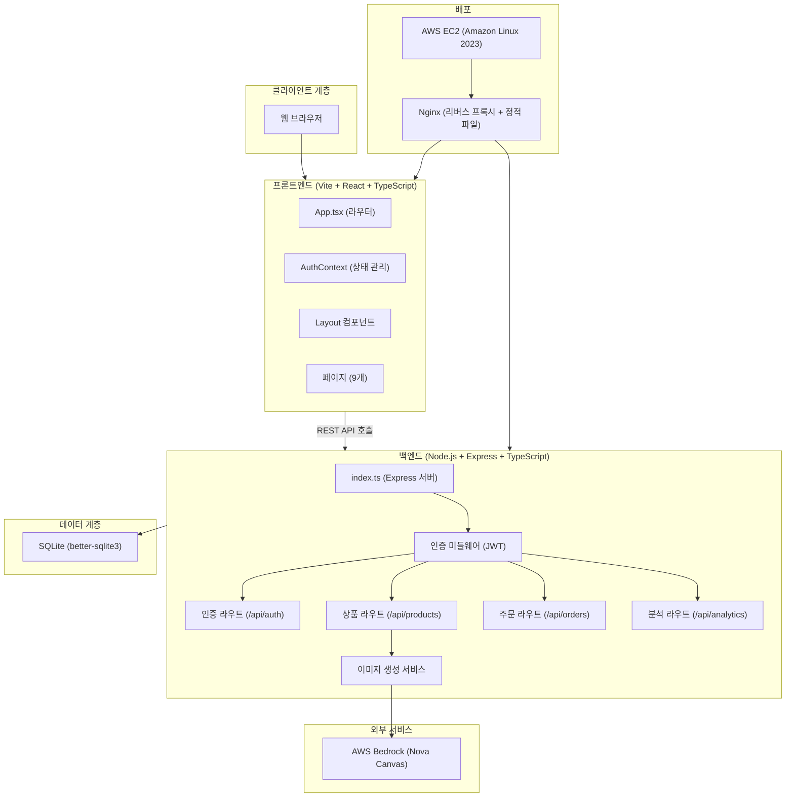
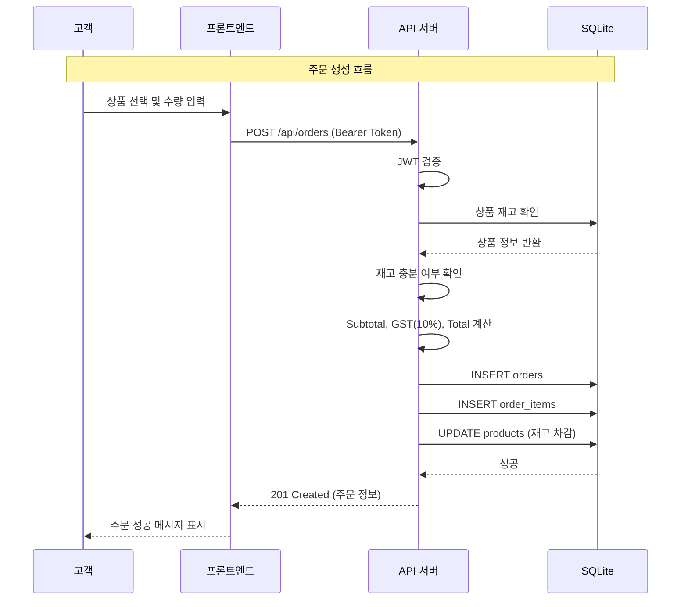

# 시스템 아키텍처

## 시스템 개요

Inventrix는 pnpm monorepo 구조의 full-stack 전자상거래 플랫폼입니다. Frontend(React SPA)와 Backend(Express REST API)로 구성되며, SQLite를 데이터 저장소로 사용합니다. 개발 시 Vite proxy를 통해 API 요청을 전달하고, 프로덕션에서는 Nginx reverse proxy를 사용합니다.

## 아키텍처 다이어그램

## 컴포넌트 설명

### 프론트엔드 (packages/frontend)
- **목적**: React 기반 SPA로 사용자 인터페이스 제공
- **책임**: 라우팅, 인증 상태 관리, API 호출, UI 렌더링
- **의존성**: react, react-dom, react-router-dom
- **유형**: 애플리케이션

### API (packages/api)
- **목적**: Express 기반 REST API 서버
- **책임**: 인증/인가, CRUD 연산, 비즈니스 로직, 외부 서비스 연동
- **의존성**: express, better-sqlite3, bcrypt, jsonwebtoken, @aws-sdk/client-bedrock-runtime
- **유형**: 애플리케이션

## 데이터 흐름

## 연동 지점

- **외부 API**:
  - AWS Bedrock (Nova Canvas v1) - AI 기반 상품 이미지 생성
- **데이터베이스**:
  - SQLite (better-sqlite3) - 모든 애플리케이션 데이터 저장 (users, products, orders, order_items)
- **서드파티 서비스**: 없음 (결제, 배송 등 미연동)

## 인프라 구성요소

- **배포 모델**: 단일 EC2 인스턴스에 Nginx + Node.js 배포
- **CDK 스택**: 없음 (bash 스크립트 기반 배포)
- **네트워킹**: 단일 Security Group, SSH/HTTP/HTTPS/3000 포트 개방 (배포자 IP 제한)
- **SSL**: 자체 서명 인증서 (Nginx)
- **프로세스 관리자**: PM2 (API 서버)
