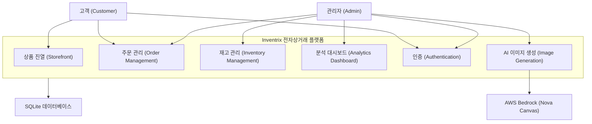

# 비즈니스 개요

## 비즈니스 컨텍스트 다이어그램

## 비즈니스 설명

- **비즈니스 설명**: Inventrix는 전자제품 및 기술 액세서리를 판매하는 full-stack 전자상거래 플랫폼입니다. 고객은 온라인 상점에서 상품을 탐색하고 주문할 수 있으며, 관리자는 상품 카탈로그, 주문 처리, 재고 수준을 관리하고 비즈니스 분석 대시보드를 통해 운영 현황을 모니터링합니다.

- **비즈니스 트랜잭션**:
  1. **상품 탐색**: 고객이 상품 목록을 조회하고 개별 상품 상세 정보를 확인
  2. **주문 생성**: 고객이 상품을 선택하고 수량을 지정하여 주문 생성 (GST 10% 자동 계산)
  3. **주문 이력 조회**: 고객이 자신의 주문 이력과 상태를 확인
  4. **주문 상태 관리**: 관리자가 주문 상태를 변경 (pending → processing → shipped → delivered / cancelled)
  5. **상품 관리**: 관리자가 상품을 추가, 수정, 삭제
  6. **AI 이미지 생성**: 관리자가 AWS Bedrock Nova Canvas를 이용하여 상품 이미지를 자동 생성
  7. **재고 모니터링**: 관리자가 재고 수준을 확인하고 부족 재고를 식별
  8. **비즈니스 분석**: 관리자가 매출, 주문 수, 인기 상품, 주문 상태별 분포 등을 확인
  9. **사용자 인증**: 사용자 로그인, 회원가입, JWT 기반 세션 관리

- **비즈니스 용어 사전**:
  | 용어 | 의미 |
  |------|------|
  | GST | 상품 및 서비스세 (Goods and Services Tax) - 10% |
  | Subtotal | 세금 전 주문 금액 |
  | 부족 재고 (Low Stock) | 재고가 10개 미만인 상품 |
  | 품절 (Out of Stock) | 재고가 0인 상품 |
  | 주문 상태 (Order Status) | pending, processing, shipped, delivered, cancelled 중 하나 |
  | 관리자 (Admin) | 상품/주문/재고 관리 권한을 가진 사용자 |
  | 고객 (Customer) | 상품 탐색 및 주문만 가능한 일반 사용자 |

## 컴포넌트별 비즈니스 설명

### 프론트엔드 (packages/frontend)
- **목적**: 고객과 관리자를 위한 웹 기반 사용자 인터페이스 제공
- **책임**: 상품 진열, 주문 생성 UI, 관리자 대시보드, 인증 화면, 재고 관리 화면

### API (packages/api)
- **목적**: 비즈니스 로직 처리 및 데이터 관리를 위한 REST API 서버
- **책임**: 인증/인가, 상품 CRUD, 주문 처리 및 재고 차감, 분석 데이터 집계, AI 이미지 생성 연동
