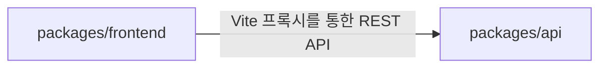

# 의존성

## 내부 의존성

프론트엔드와 API 간에는 코드 레벨 의존성이 없으며, HTTP REST API를 통해서만 통신합니다.

## 외부 의존성

### 백엔드 (packages/api)

| 의존성 | 버전 | 목적 | 라이선스 |
|--------|------|------|----------|
| express | ^4.18.2 | REST API 프레임워크 | MIT |
| better-sqlite3 | ^9.2.2 | SQLite 데이터베이스 드라이버 | MIT |
| bcrypt | ^5.1.1 | 비밀번호 해싱 | MIT |
| jsonwebtoken | ^9.0.2 | JWT 인증 토큰 | MIT |
| cors | ^2.8.5 | Cross-Origin Resource Sharing | MIT |
| @aws-sdk/client-bedrock-runtime | ^3.700.0 | AWS Bedrock AI 이미지 생성 | Apache-2.0 |

### 프론트엔드 (packages/frontend)

| 의존성 | 버전 | 목적 | 라이선스 |
|--------|------|------|----------|
| react | ^18.2.0 | UI 프레임워크 | MIT |
| react-dom | ^18.2.0 | React DOM 렌더링 | MIT |
| react-router-dom | ^6.21.1 | 클라이언트 사이드 라우팅 | MIT |

## 개발 의존성

### 백엔드
- @types/express, @types/better-sqlite3, @types/bcrypt, @types/jsonwebtoken, @types/cors, @types/node - TypeScript 타입 정의
- typescript ^5.3.3 - TypeScript 컴파일러
- tsx ^4.7.0 - TypeScript 실행기 (개발 모드)

### 프론트엔드
- @types/react, @types/react-dom - TypeScript 타입 정의
- @vitejs/plugin-react ^4.2.1 - Vite React 플러그인
- typescript ^5.3.3 - TypeScript 컴파일러
- vite ^5.0.10 - 빌드 도구
