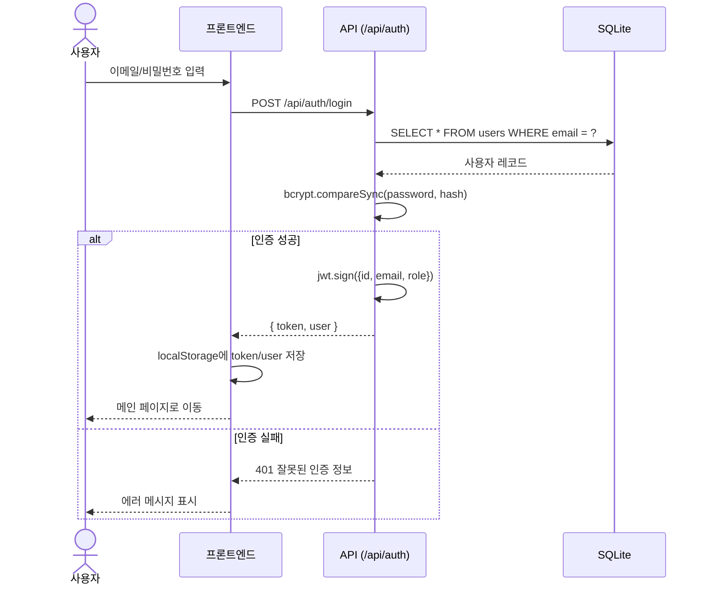
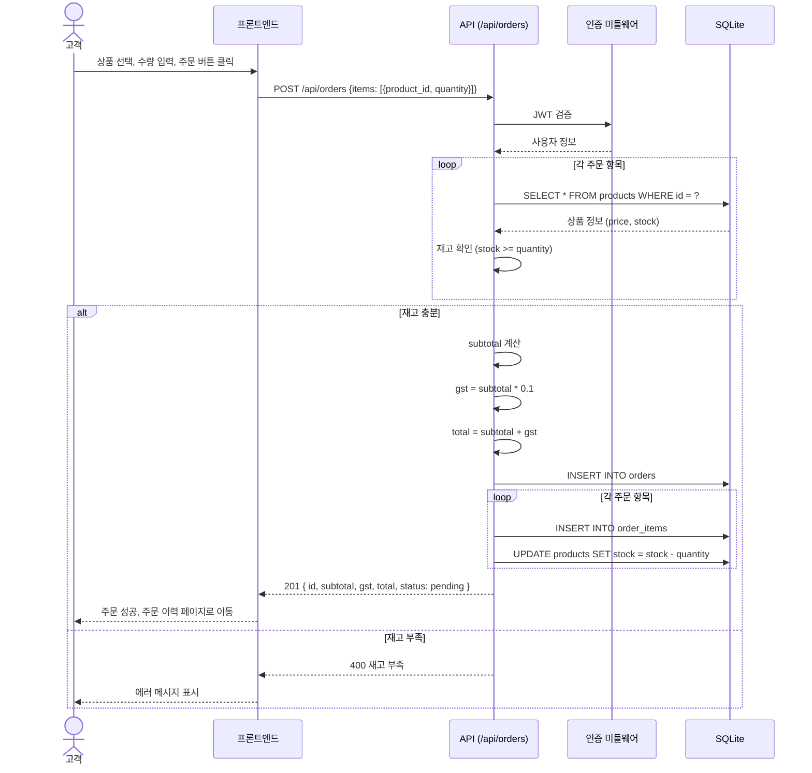
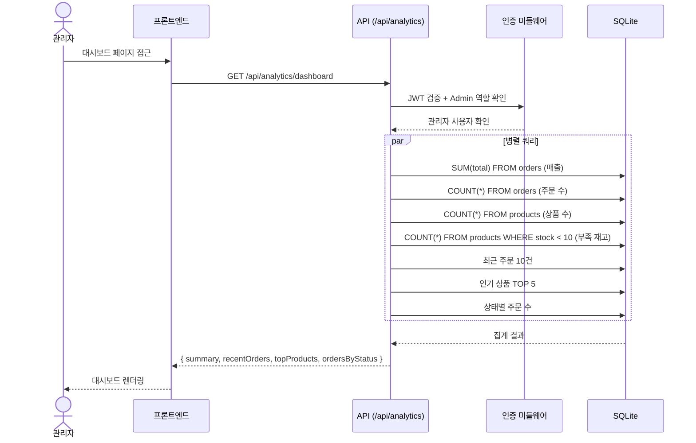
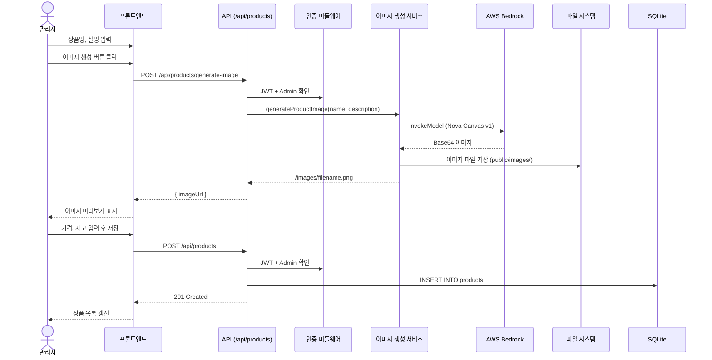

# 상호작용 다이어그램

## 비즈니스 트랜잭션 흐름

### 1. 사용자 인증 흐름

```mermaid
sequenceDiagram
    actor User as 사용자
    participant F as 프론트엔드
    participant A as API (/api/auth)
    participant DB as SQLite
    
    User->>F: 이메일/비밀번호 입력
    F->>A: POST /api/auth/login
    A->>DB: SELECT * FROM users WHERE email = ?
    DB-->>A: 사용자 레코드
    A->>A: bcrypt.compareSync(password, hash)
    alt 인증 성공
        A->>A: jwt.sign({id, email, role})
        A-->>F: { token, user }
        F->>F: localStorage에 token/user 저장
        F-->>User: 메인 페이지로 이동
    else 인증 실패
        A-->>F: 401 잘못된 인증 정보
        F-->>User: 에러 메시지 표시
    end
```

### 2. 주문 생성 흐름

```mermaid
sequenceDiagram
    actor Customer as 고객
    participant F as 프론트엔드
    participant A as API (/api/orders)
    participant Auth as 인증 미들웨어
    participant DB as SQLite
    
    Customer->>F: 상품 선택, 수량 입력, 주문 버튼 클릭
    F->>A: POST /api/orders {items: [{product_id, quantity}]}
    A->>Auth: JWT 검증
    Auth-->>A: 사용자 정보
    
    loop 각 주문 항목
        A->>DB: SELECT * FROM products WHERE id = ?
        DB-->>A: 상품 정보 (price, stock)
        A->>A: 재고 확인 (stock >= quantity)
    end
    
    alt 재고 충분
        A->>A: subtotal 계산
        A->>A: gst = subtotal * 0.1
        A->>A: total = subtotal + gst
        A->>DB: INSERT INTO orders
        loop 각 주문 항목
            A->>DB: INSERT INTO order_items
            A->>DB: UPDATE products SET stock = stock - quantity
        end
        A-->>F: 201 { id, subtotal, gst, total, status: pending }
        F-->>Customer: 주문 성공, 주문 이력 페이지로 이동
    else 재고 부족
        A-->>F: 400 재고 부족
        F-->>Customer: 에러 메시지 표시
    end
```

### 3. 관리자 대시보드 조회 흐름

```mermaid
sequenceDiagram
    actor Admin as 관리자
    participant F as 프론트엔드
    participant A as API (/api/analytics)
    participant Auth as 인증 미들웨어
    participant DB as SQLite
    
    Admin->>F: 대시보드 페이지 접근
    F->>A: GET /api/analytics/dashboard
    A->>Auth: JWT 검증 + Admin 역할 확인
    Auth-->>A: 관리자 사용자 확인
    
    par 병렬 쿼리
        A->>DB: SUM(total) FROM orders (매출)
        A->>DB: COUNT(*) FROM orders (주문 수)
        A->>DB: COUNT(*) FROM products (상품 수)
        A->>DB: COUNT(*) FROM products WHERE stock < 10 (부족 재고)
        A->>DB: 최근 주문 10건
        A->>DB: 인기 상품 TOP 5
        A->>DB: 상태별 주문 수
    end
    
    DB-->>A: 집계 결과
    A-->>F: { summary, recentOrders, topProducts, ordersByStatus }
    F-->>Admin: 대시보드 렌더링
```

### 4. 상품 관리 (AI 이미지 생성 포함) 흐름

```mermaid
sequenceDiagram
    actor Admin as 관리자
    participant F as 프론트엔드
    participant A as API (/api/products)
    participant Auth as 인증 미들웨어
    participant ImgSvc as 이미지 생성 서비스
    participant Bedrock as AWS Bedrock
    participant FS as 파일 시스템
    participant DB as SQLite
    
    Admin->>F: 상품명, 설명 입력
    Admin->>F: 이미지 생성 버튼 클릭
    F->>A: POST /api/products/generate-image
    A->>Auth: JWT + Admin 확인
    A->>ImgSvc: generateProductImage(name, description)
    ImgSvc->>Bedrock: InvokeModel (Nova Canvas v1)
    Bedrock-->>ImgSvc: Base64 이미지
    ImgSvc->>FS: 이미지 파일 저장 (public/images/)
    ImgSvc-->>A: /images/filename.png
    A-->>F: { imageUrl }
    F-->>Admin: 이미지 미리보기 표시
    
    Admin->>F: 가격, 재고 입력 후 저장
    F->>A: POST /api/products
    A->>Auth: JWT + Admin 확인
    A->>DB: INSERT INTO products
    A-->>F: 201 Created
    F-->>Admin: 상품 목록 갱신
```
